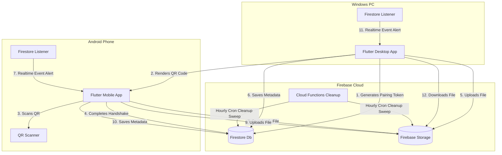

# QuickBridge 🚀

QuickBridge is a secure, production-ready, cross-platform file transfer system built with **Flutter** and **Firebase**. It allows instant bidirectional file transfers between **Android** and **Windows** devices using only the internet, completely bypassing the need for user accounts, logins, or authentication credentials. Pairing is performed dynamically using secure QR codes.

---

## 🏗️ Architecture Diagram



---

## 📂 Project Folder Structure

```text
quickbridge/
├── android/                         # Android build and manifest setup
├── windows/                         # Windows desktop runner setup
├── assets/                          # Images and app icon assets
├── firebase/                        # Firebase Cloud Functions code
│   └── functions/
│       ├── index.js                 # Automated cleanup Cloud Function
│       └── package.json             # Function dependencies
├── lib/                             # Core Flutter application code
│   ├── main.dart                    # App Entrypoint
│   ├── core/
│   │   ├── constants/
│   │   │   └── constants.dart       # Allowed files list, sizes, collections
│   │   ├── theme/
│   │   │   └── theme.dart           # Harmonious M3 Dark/Light themes
│   │   ├── services/
│   │   │   └── notification_service.dart # Local notifications manager
│   │   └── utils/
│   │       ├── file_utils.dart      # Extensions, size (200MB), MIME checking
│   │       └── speed_calculator.dart # Realtime MB/s and ETA estimator
│   ├── domain/
│   │   ├── models/
│   │   │   ├── file_metadata_model.dart
│   │   │   └── pairing_model.dart
│   │   └── repositories/
│   │       ├── file_transfer_repository.dart
│   │       └── pairing_repository.dart
│   ├── data/
│   │   └── repositories/
│   │       ├── file_transfer_repository_impl.dart
│   │       └── pairing_repository_impl.dart
│   └── presentation/
│       ├── providers/
│       │   ├── pairing_provider.dart
│       │   ├── settings_provider.dart
│       │   └── transfer_provider.dart
│       ├── screens/
│       │   ├── shared/
│       │   │   ├── settings_screen.dart
│       │   │   └── splash_screen.dart
│       │   ├── android/
│       │   │   ├── android_connected_screen.dart
│       │   │   └── scan_qr_screen.dart
│       │   └── windows/
│       │       ├── qr_pair_screen.dart
│       │       └── windows_connected_screen.dart
│       └── widgets/
│           ├── file_transfer_card.dart  # Displays speed & progress bars
│           └── offline_indicator.dart   # Auto-reconnection banner
├── firebase.json                    # Firebase CLI deployment map
├── firestore.rules                  # Firestore security rules
├── storage.rules                    # Storage security rules
└── pubspec.yaml                     # Dependencies definition
```

---

## 🛠️ Local Development & Setup

### 1. Prerequisites
- **Flutter SDK**: Install the latest stable version of Flutter from [flutter.dev](https://flutter.dev).
- **Node.js**: Required to deploy Firebase Cloud Functions.
- **Firebase CLI**: Install using `npm install -g firebase-tools`.

### 2. Firebase Project Initialization
1. Go to the [Firebase Console](https://console.firebase.google.com/) and create a new project named `QuickBridge`.
2. Enable the following services:
   - **Cloud Firestore**
   - **Firebase Storage**
3. Open a terminal in the project directory and login to Firebase:
   ```bash
   firebase login
   ```
4. Link the directory to your project:
   ```bash
   firebase use --add
   ```
5. Deploy security rules and functions:
   ```bash
   firebase deploy
   ```

### 3. Flutter Integration Configurations
Ensure your target platform apps are linked to your Firebase project:
- Run the FlutterFire configuration tool:
  ```bash
  flutterfire configure
  ```
  Select **Android** and **Windows** targets to automatically generate registration configurations inside your app (`firebase_options.dart`).

---

## 📦 Build Instructions

### 1. Windows App (EXE)
To generate a release-ready standalone executable for Windows 10 & 11:
1. Enable Windows Developer Mode on your machine.
2. Enable Windows support in Flutter:
   ```bash
   flutter config --enable-windows-desktop
   ```
3. Compile the production bundle:
   ```bash
   flutter build windows --release
   ```
4. The output EXE and its supporting files will be located at:
   `build/windows/runner/Release/`

### 2. Android App (APK)
To build the target production APK:
1. Ensure the Android SDK is configured in your Flutter environment.
2. Compile the package:
   ```bash
   flutter build apk --release
   ```
3. The generated release APK will be located at:
   `build/app/outputs/flutter-apk/app-release.apk`

---

## 🔒 Security Policies
- **No Logins/Accounts**: User activity is completely untracked.
- **TLS Transfers**: All uploads and downloads run over HTTPS.
- **Integrity Validation**: The app verifies file extensions, size limits (200MB), and underlying MIME types *before* uploads commence.
- **Failsafe Rules**: Firestore rules check document constraints and Storage rules validate file size and content types to prevent malformed or malicious uploads.
